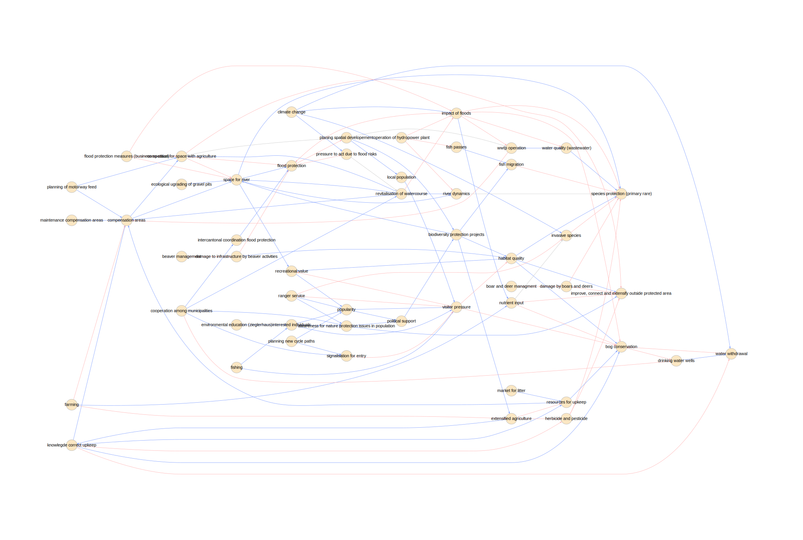
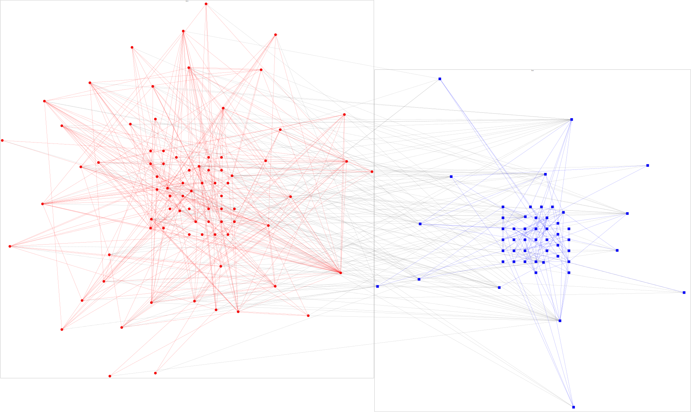

<!-- README.md is generated from README.Rmd. Please edit that file -->

```{r, include = FALSE}
knitr::opts_chunk$set(
  collapse = TRUE,
  comment = "#>",
  fig.path = "man/figures/README-",
  out.width = "100%"
)
```

<!-- Thanks for this: https://r-pkgs.org/ -->

<!-- Must make a hex sticker at some point: https://cran.r-project.org/web/packages/hexSticker/readme/README.html -->

<!-- For packages that depend on python stuff, useful updates here: -->
<!-- https://blog.rstudio.com/2019/12/20/reticulate-1-14/ -->

<!-- "To that end, we’ve made the following changes. If the user has not explicitly instructed reticulate to use a pre-existing Python environment, then: -->
<!-- 1) reticulate will prompt the user to download and install Miniconda; -->
<!-- 2) reticulate will prepare a default r-reticulate Conda environment, using (currently) Python 3.6 and NumPy; -->
<!-- 3) When Python is initialized, reticulate will query any loaded R packages for their Python dependencies, and install those dependencies into the aforementioned r-reticulate Conda environment." -->

<!-- badges: start -->
<!-- badges: end -->

This package provides tools to analyze and visualize multi-level networks in general, and so-called integrated networks specifically.

Multi-level networks combine multiple networks in one, e.g. social-ecological networks.
Integrated networks are specific networks combining causal loop diagrams (CLDs) and social networks.

The package has three main areas: Visualization, Aggregation and Analysis.

  - Visualization: The package visualizes CLDs and two-level networks.
  
  - Aggregation: The package implements ways to aggregate CLDs to use as inputs in multi-level networks by way of finding common causes of parts of a CLD.
  
  - Analysis: The package is in many parts a R wrapper for the excellent [sesmotifanalyser](https://gitlab.com/t.seppelt/sesmotifanalyser) Python framework written by Tim Seppelt to count multi-level network motifs, compare them to a baseline and much more. It further identifies and visualizes functional gaps in integrated networks and virtuous and vicious cycles in CLDs.


## Installation

The package is currently at a very early stage of development. Explore at your own risk and please report any issues using the [issue tracker on github](https://github.com/marioangst/integrateR/issues). You can install the package from github, using devtools:

```{r eval=FALSE}
devtools::install_github("marioangst/integrater")
```


## Examples


```{r}
library(integrateR)
```

Visualize a causal loop diagram, based on DiagrammeR. This is based on an expert interview conducted in a Swiss wetland.

```{r, eval=FALSE}
cld_viz <- visualize_cld_graph(concepts_df = cld_concepts, 
                               links_df = cld_el, 
                               id_column = "concept", 
                               label_column = "english",
                               layout = "dot",
                               color_mapping = list(Target = "gray"), 
                               shape_mapping = list(Activity = "square"))

cld_viz$plot
```



### Visualize a multi-level network.

Visualizations exist for two-level networks at the moment. The following uses DiagrammeR and is based on a network model gathered in a Swiss wetland. Actors are red, activities in wetlands governance are blue. Relations between activities are based on causal interdependence:

```{r, eval=FALSE}
visualize_mnet(actor_df = actors,
               issue_df = cld_concepts,
               actor_links = actor_el, 
               actor_issue_links = actor_concept_el,
               issue_links = cld_el,
               viz = "graphviz")
```



### Count motifs. 
3-node motifs and 4-node motifs are possible to count. You can display possible configurations with their names.

```{r}
show_3_motifs()
```

```{r}
show_4_motifs()
```

```{r echo=FALSE}
load_python_sma()
```

This counts the number of times a motif occurs, using the wetlands governance network visualized above, here for 3-node motifs with a focal (single) node, which is social.

```{r}
count_motifs(net = ml_net,
             type_attr = "sesType",
             number_nodes = 3,
             motif = "I.C",
             three_motif_focus = "social")
```

This counts the number of times a motif occurs for a four-motif configuration.

```{r, cache=TRUE}
count_motifs(net = ml_net,
             type_attr = "sesType",
             number_nodes = 4,
             motif = "II.A")
```

Advanced motif classifications based on sesmotifanalyser syntax can be specified.
Here an optional parameter specifies that a given actor must be included in the motif.

```{r, cache=TRUE}
count_motifs(net = ml_net,
             type_attr = "sesType",
             number_nodes = 4,
             motif = "II.A", sma$hasNode("actor5"))
```
