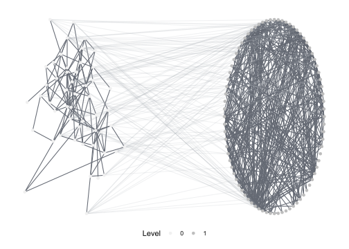
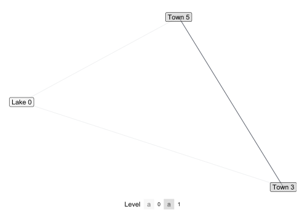
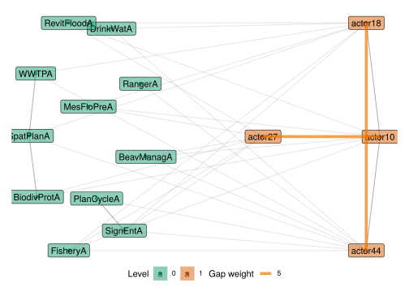
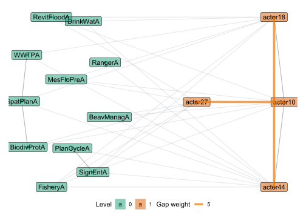

integrateR
================

<!-- README.md is generated from README.Rmd. Please edit that file -->

<!-- Thanks for this: https://r-pkgs.org/ -->

<!-- Must make a hex sticker at some point: https://cran.r-project.org/web/packages/hexSticker/readme/README.html -->

<!-- For packages that depend on python stuff, useful updates here: -->

<!-- https://blog.rstudio.com/2019/12/20/reticulate-1-14/ -->

<!-- "To that end, we’ve made the following changes. If the user has not explicitly instructed reticulate to use a pre-existing Python environment, then: -->

<!-- 1) reticulate will prompt the user to download and install Miniconda; -->

<!-- 2) reticulate will prepare a default r-reticulate Conda environment, using (currently) Python 3.6 and NumPy; -->

<!-- 3) When Python is initialized, reticulate will query any loaded R packages for their Python dependencies, and install those dependencies into the aforementioned r-reticulate Conda environment." -->

<!-- badges: start -->

<!-- badges: end -->

This package provides tools to analyze multi-level networks in terms of
*motifs*. Motifs are small configurations of nodes within an overall
network

Multi-level networks combine multiple networks in one representation,
e.g. social-ecological networks, which connect a social network (eg.
interactions among fishermen) with an ecological network (eg.
interactions between fish species) and the ties inbetween (eg. fishers
who fish specific species).

The package has three main areas: Visualization and Analysis.

  - Visualization: The package provides functions to visualize
    multi-level networks, based on
    [ggraph](https://github.com/thomasp85/ggraph).

  - Analysis: The package is in many parts a R wrapper for the excellent
    [sesmotifanalyser](https://gitlab.com/t.seppelt/sesmotifanalyser)
    Python framework written by Tim Seppelt to count multi-level network
    motifs, compare them to a baseline and much more. Only parts of of
    sesmotifanalyser are yet wrapped, so consult the python framework
    for additional functionality. IntegrateR further identifies and
    visualizes functional gaps and critical edges in integrated networks
    based on theories of fit and misfit.

## Installation

The package is currently at a very early stage of development. Explore
at your own risk and please report any issues using the [issue tracker
on github](https://github.com/marioangst/integrateR/issues). You can
install the package from github, using devtools:

``` r
devtools::install_github("marioangst/integrateR")
```

## Examples

``` r
library(integrateR)
```

### Visualize a multi-level network

The following network is an example network from an empirical analysis
of wetlands management in Switzerland. It consists of two levels - one
level specifies a network of relations between actors. A second level
specifies a network of relations between different activities occurring
in the wetland, based on causal interdependence among activites. Links
between the levels specify which actors carry out which activities.

It is possible to specify layouts for every network level separately.

``` r
plot_mnet(net = ml_net,
          type_attr = "sesType",
          layouts = list("kk","circle"))
```



### Count motifs

Motifs can be counted using the versatile function `count_motifs()`. It
takes as parameters a statnet network object (use `ml_net` or
`dummy_net` provided by this package as example) and a list of motif
identifiers (see below) specifying the motifs.

``` r
motifs = list('1,2[I.C]', '1,2[II.C]') # open and closed triangle

count_motifs(ml_net, motifs)
#>       1,2[I.C] 1,2[II.C]
#> count      543       167
```

An exploratory approach can be taken by calling `motif_summary()`. This
function counts the occurrences of a couple of interesting motifs.
Furthermore it computes expectations and variances for the occurrence of
this motif in a modified Erdős-Rényi model.

``` r
motif_summary(ml_net)
#>             1,2[I.C] 1,2[II.C] 2,1[I.C] 2,1[II.C] 2,2[III.C] 2,2[III.D]
#> count       543.0000 167.00000 217.0000   7.00000 73.0000000 1.00000000
#> expectation 169.1442  16.96154 109.9057  10.23854  0.4481177 0.04174551
#> variance    949.7743  25.69287 437.5976  13.91309        NaN        NaN
```

### Motif classification – what do all this codes stand for?

Motifs are small subgraphs whose occurrences can reveal interesting
structures in empirical networks. Motifs can span several levels of a
multilevel networks. This package uses *motif identifier strings* for
identifying motifs. These must provide information about

  - the number of nodes contained by the motif on the various levels of
    the network (*signature* and *positions*),
  - the structure of the motif itself, i.e. which edges are present,
    (*motif class*).

A motif identifier string contains these two pieces of information. It
consists of a *head* and *class*, and is for the form `HEAD[CLASS]`,
e.g. `1,2[II.C]`. The head specifies the signature and the positions of
the motif while the class represents the motif class.

Let’s consider an example. The motif identifier string `1,2[II.C]`
represents the closed triangle with one node on level 0 (the ecological
level) and two nodes on level 1 (the social level). `1,2` signifies that
the first level provides one node and the second two nodes. The
expression `II.C` in brackets stands for closed triangle. Alternatively,
`1,2[I.C]` represents the open triangle with the same number of nodes
taken from the levels.

``` r
show_motif('1,2[II.C]', label = TRUE)
```



A full list of all supported signatures and motif classes can be found
in the [documentation of the Python sma
package](https://gitlab.com/t.seppelt/sesmotifanalyser/raw/master/doc/_build/latex/SESMotifAnalyser.pdf?inline=false)
in section *Appendix: The Motif Zoo*.

This package uses an internal mechanism called *position matching* for
translating the head of a motif identifier string, e.g. `1,2`, two a
sequence of levels corresponding the signature of the motif. Usually,
this procedure yields the desired matching and is of no interest to the
user. However, sometimes it might be necessary two overwrite the
position matching by providing custom positions.

An example for this is the motif `2,2[II.D]`. It contains two nodes on
level 0 and two nodes on level 1. The two nodes on level 0 and the two
nodes on level 1 are respectively adjacent. Furthermore the two nodes on
level 0 are linked to one of the nodes on level 1. This motif differs
from the motif `2:1,2:0[II.D]` which contains the same number of nodes
from the different levels. However, here the roles of the levels are
swapped, i.e. in this motif, the two nodes on level 1 are adjacent to
the two nodes on level 0.

``` r
show_motif('2,2[II.D]', label = TRUE)
```



``` r
show_motif('2:1,2:0[II.D]', label = TRUE)
```


The position matching can be overwritten by providinng the levels
corresponding to the entries in the motif signature, e.g. the head
`2:1,2:0` signalises that the first level containing two nodes is level
1 while the second level containing two nodes is level 0. See the
[documentation of the Python sma
package](https://gitlab.com/t.seppelt/sesmotifanalyser/raw/master/doc/_build/latex/SESMotifAnalyser.pdf?inline=false),
subsection *Position matching* for a detailed description of the
procedure.

In general, it is recommended to use `show_motif(motif)` to check
whether the provided motif identifier string is interpreted as intended
by the software.

### Comparing motif occurrence to a random baseline

This package can be used to simulate a random baseline of networks.
Motif counts in an empirical network can then be compared to the
distribution of motif counts in the random networks.

``` r
motifs = list('1,2[I.C]', '1,2[II.C]') # open and closed triangle

compare_to_baseline(ml_net, motifs = motifs, n = 100)
#> No id variables; using all as measure variables
#> No id variables; using all as measure variables
#> `stat_bin()` using `bins = 30`. Pick better value with `binwidth`.
```


