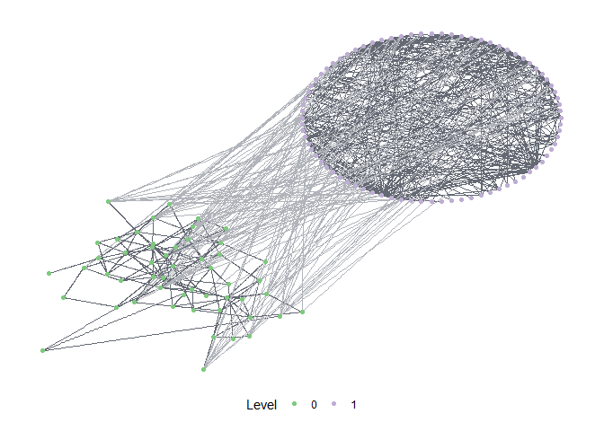
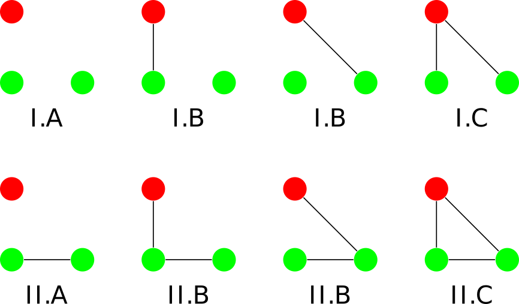

integrateR
================

<!-- README.md is generated from README.Rmd. Please edit that file -->

<!-- Thanks for this: https://r-pkgs.org/ -->

<!-- Must make a hex sticker at some point: https://cran.r-project.org/web/packages/hexSticker/readme/README.html -->

<!-- For packages that depend on python stuff, useful updates here: -->

<!-- https://blog.rstudio.com/2019/12/20/reticulate-1-14/ -->

<!-- "To that end, we’ve made the following changes. If the user has not explicitly instructed reticulate to use a pre-existing Python environment, then: -->

<!-- 1) reticulate will prompt the user to download and install Miniconda; -->

<!-- 2) reticulate will prepare a default r-reticulate Conda environment, using (currently) Python 3.6 and NumPy; -->

<!-- 3) When Python is initialized, reticulate will query any loaded R packages for their Python dependencies, and install those dependencies into the aforementioned r-reticulate Conda environment." -->

<!-- badges: start -->

<!-- badges: end -->

This package provides tools to analyze multi-level networks in terms of
*motifs*. Motifs are small configurations of nodes within an overall
network

Multi-level networks combine multiple networks in one representation,
e.g. social-ecological networks, which connect a social network (eg.
interactions among fishermen) with an ecological network (eg.
interactions between fish species) and the ties inbetween (eg. fishers
who fish specific species).

The package has three main areas: Visualization and Analysis.

  - Visualization: The package provides functions to visualize
    multi-level networks, based on
    [ggraph](https://github.com/thomasp85/ggraph).

  - Analysis: The package is in many parts a R wrapper for the excellent
    [sesmotifanalyser](https://gitlab.com/t.seppelt/sesmotifanalyser)
    Python framework written by Tim Seppelt to count multi-level network
    motifs, compare them to a baseline and much more. Only parts of of
    sesmotifanalyser are yet wrapped, so consult the python framework
    for additional functionality. IntegrateR further identifies and
    visualizes functional gaps and critical edges in integrated networks
    based on theories of fit and misfit.

## Installation

The package is currently at a very early stage of development. Explore
at your own risk and please report any issues using the [issue tracker
on github](https://github.com/marioangst/integrateR/issues). You can
install the package from github, using devtools:

``` r
devtools::install_github("marioangst/integrateR")
```

## Examples

``` r
library(integrateR)
```

### Visualize a multi-level network

The following network is an example network from an empirical analysis
of wetlands management in Switzerland. It consists of two levels - one
level specifies a network of relations between actors. A second level
specifies a network of relations between different activities occurring
in the wetland, based on causal interdependence among activites. Links
between the levels specify which actors carry out which activities.

It is possible to specify layouts for every network level separately.

``` r
plot_mnet(net = ml_net,
          type_attr = "sesType",
          layouts = list("kk","circle"))
```



### Count motifs

tbd

``` r
motifs = list('1,2[I.C]', '1,2[II.C]')
motif = c('1,2[II.C]') # closed triangle

compare_to_baseline(ml_net, motifs = motifs, n = 100)
#> No id variables; using all as measure variables
#> No id variables; using all as measure variables
#> `stat_bin()` using `bins = 30`. Pick better value with `binwidth`.
```



### Motif classification - what do all this codes stand for?

tbd

### How does motif counting work

tbd
