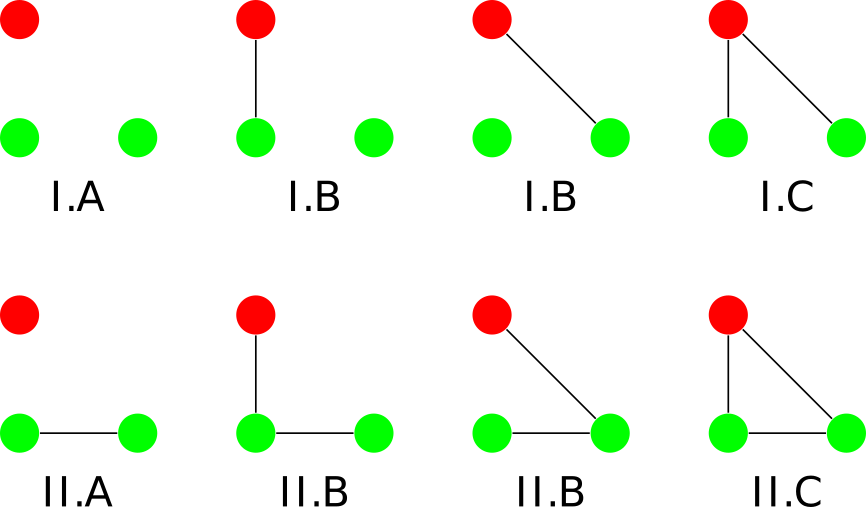

motifr 
================

<!-- README.md is generated from README.Rmd. Please edit that file -->

<!-- Thanks for this: https://r-pkgs.org/ -->

<!-- Must make a hex sticker at some point: https://cran.r-project.org/web/packages/hexSticker/readme/README.html -->

<!-- For packages that depend on python stuff, useful updates here: -->

<!-- https://blog.rstudio.com/2019/12/20/reticulate-1-14/ -->

<!-- "To that end, we’ve made the following changes. If the user has not explicitly instructed reticulate to use a pre-existing Python environment, then: -->

<!-- 1) reticulate will prompt the user to download and install Miniconda; -->

<!-- 2) reticulate will prepare a default r-reticulate Conda environment, using (currently) Python 3.6 and NumPy; -->

<!-- 3) When Python is initialized, reticulate will query any loaded R packages for their Python dependencies, and install those dependencies into the aforementioned r-reticulate Conda environment." -->

<!-- badges: start -->

<!-- badges: end -->

This package provides tools to analyze multi-level networks in terms of
*motifs*.

Multi-level networks combine multiple networks in one representation,
e.g. social-ecological networks, which connect a social network (eg.
interactions among fishermen) with an ecological network (eg.
interactions between fish species) and the ties inbetween (eg. fishers
who fish specific species).

[Motifs](https://en.wikipedia.org/wiki/Network_motif) are small
configurations of nodes and edges (subgraphs) within an overall network.

Package features include:

  - Visualization: The package provides functions to visualize
    multi-level networks, based on
    [ggraph](https://github.com/thomasp85/ggraph).

  - Motif counts: The package is in many parts a R wrapper for the
    excellent
    [sesmotifanalyser](https://gitlab.com/t.seppelt/sesmotifanalyser)
    Python framework written by Tim Seppelt to count multi-level network
    motifs, compare them to a baseline and much more. Only parts of of
    sesmotifanalyser are yet wrapped, so consult the python framework
    for additional functionality.

  - Contributions of edges to motifs: motifr further identifies and
    visualizes functional gaps and critical edges in multi-level
    networks based on contributions of existing or potential edges to
    given motifs (this is theoretically based on network theories of
    functional fit and misfit).

## Installation

The package is currently at an early stage of development. Explore at
your own risk and please report any issues using the [issue tracker on
github](https://github.com/marioangst/motifr/issues). You can install
the package from github, using devtools:

``` r
devtools::install_github("marioangst/motifr")
```

## Examples

``` r
library(motifr)
```

### Visualize a multi-level network

The following network is an example network from an empirical analysis
of wetlands management in Switzerland. It consists of two levels - one
level specifies a network of relations between actors. A second level
specifies a network of relations between different activities occurring
in the wetland, based on causal interdependence among activites. Links
between the levels specify which actors carry out which activities.

It is possible to specify layouts for every network level separately.
Below, one level is plotted based on a circle layout, the second one
based on Kamada-Kawai.

``` r
plot_mnet(net = ml_net,
          type_attr = "sesType",
          layouts = list("kk","circle"))
```


### Count motifs

Motifs can be counted using the versatile function `count_motifs()`. It
takes as parameters a statnet network object (use `ml_net` or
`dummy_net` provided by this package as example) and a list of motif
identifiers (see below) specifying the motifs. See the package [vignette
on the motif zoo](vignettes/motif_zoo.Rmd) for details on nomenclature
for motifs (motif identifier strings). Let’s quickly check out some
examples of three-node, two-level motifs.



Let’s count two of these motifs (open and closed triangles) in the
wetland management network introduced above.

``` r
motifs = list('1,2[I.C]', '1,2[II.C]') # open and closed triangle

count_motifs(ml_net, motifs)
#>       1,2[I.C] 1,2[II.C]
#> count      543       167
```

An exploratory approach can be taken by calling `motif_summary()`. This
function counts the occurrences of a couple of interesting motifs.
Furthermore it computes expectations and variances for the occurrence of
these motifs in a modified Erdős-Rényi model.

``` r
motif_summary(ml_net)
#>             1,2[I.C] 1,2[II.C] 2,1[I.C] 2,1[II.C] 2,2[III.C] 2,2[III.D]
#> count       543.0000 167.00000 217.0000   7.00000 73.0000000 1.00000000
#> expectation 169.1442  16.96154 109.9057  10.23854  0.4481177 0.04174551
#> variance    949.7743  25.69287 437.5976  13.91309        NaN        NaN
```

### Identify gaps and critical edges

motifr makes it possible to identify gaps and critical edges in
multi-level networks. This is motivated by theories of functional fit
and misfit in networks, which posit that certain motifs are especially
valuable for network outcomes (depending on the context).

In relation to gaps, we can therefore try to identify potential edges
that would create a large number of a given motif if they were to exist
(“activated” or “flipped”). The number of such motifs created by an edge
is their contribution. For example, we can get all edges that would
create closed triangles (‘1,2\[II.C\]’), including the information about
how many such triangles they would create for the wetlands case study
network:

``` r
gaps <- identify_gaps(ml_net, motif = '1,2[II.C]')
head(gaps)
#>   vertex0 vertex1 contribution
#> 1 actor10 actor27            5
#> 2 actor18 actor44            5
#> 3  actor6 actor24            4
#> 4 actor16 actor55            4
#> 5 actor18 actor27            4
#> 6 actor18 actor31            4
```

We can also plot these gaps in our network, including option to only
look at gaps above a certain weight (contribution) and different levels
of focus to only show nodes involved in such gaps. Here again for the
wetlands management network, only showing gaps with a weight above 5.

``` r
plot_gaps(ml_net, 
          "1,2[II.C]", 
          level = -1, 
          subset_graph = "partial", 
          cutoff = 5, label = TRUE)
```


`identify_gaps` has a sibling in `critical_dyads`. Critical\_dyads works
in reverse to identifying gaps - it analyzes for every existing edge how
many instances of a given motif would disappear if the edge would be
removed.

### Comparing motif occurrence to a random baseline

Motifr can be used to simulate a random baseline of networks. Motif
counts in an empirical network can then be compared to the distribution
of motif counts in the random networks. We do so again here for open and
closed triangles in the wetland management network. Unsurprisingly, we
find that both of these motifs occur much more often in the empirically
observed network than in the random baseline.

``` r
motifs = list('1,2[I.C]', '1,2[II.C]') # open ('1,2[I.C]') and closed ('1,2[II.C]') triangles

compare_to_baseline(ml_net, motifs = motifs, n = 100)
#> No id variables; using all as measure variables
#> No id variables; using all as measure variables
#> `stat_bin()` using `bins = 30`. Pick better value with `binwidth`.
```


