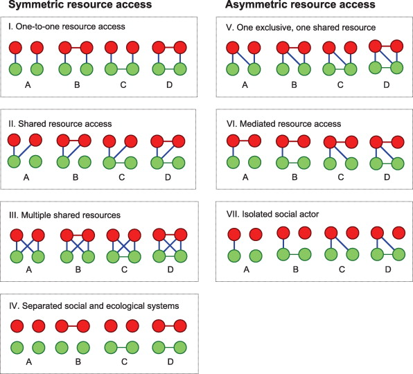
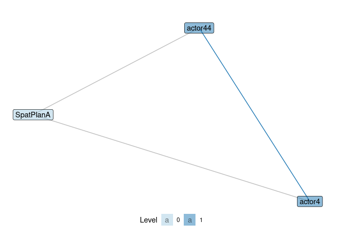
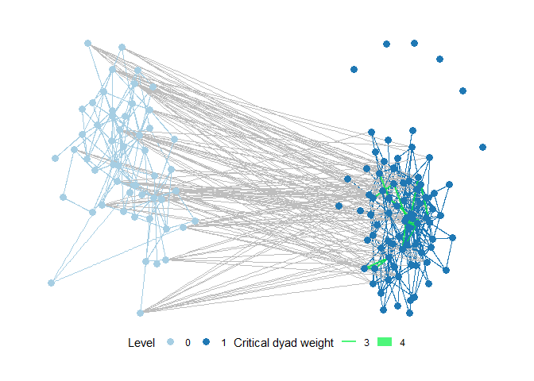

# motifr <a href='https://marioangst.github.io/motifr/'></a>

<!-- README.md is generated from README.Rmd. Please edit that file -->

<!-- badges: start -->

[](https://travis-ci.org/marioangst/motifr)
<!-- badges: end -->

This package provides tools to analyse multi-level networks in terms of
*motifs*.

Multi-level networks combine multiple networks in one representation,
e.g. social-ecological networks, which connect a social network
(e.g. interactions among fishermen) with an ecological network
(e.g. interactions between fish species) and the ties in between
(e.g. fishers who fish specific species).

[Motifs](https://en.wikipedia.org/wiki/Network_motif) are small
configurations of nodes and edges (subgraphs) within an overall network.

Package features include:

  - Visualization: The package provides functions to visualize
    multi-level networks, based on
    [ggraph](https://CRAN.R-project.org/package=ggraph).

  - Motif counts: The package is in many parts a R wrapper for the
    excellent
    [SESMotifAnalyser](https://gitlab.com/t.seppelt/sesmotifanalyser)
    Python framework written by Tim Seppelt to count multi-level network
    motifs, compare them to a baseline and much more. Only parts of of
    SESMotifAnalyser are yet wrapped, so consult the python framework
    for additional functionality.

  - Contributions of edges to motifs: motifr further identifies and
    visualizes functional gaps and critical edges in multi-level
    networks based on contributions of existing or potential edges to
    given motifs (this is theoretically motivated by network theories of
    functional fit and misfit).

## Installation

Due to the package’s tight integration with the Python framework
SESMotifAnalyser, we recommend explicitly installing the associated sma
module through reticulate.

``` r
reticulate::py_install("sma", pip = TRUE)
```

You can then install motifr from github, using devtools:

``` r
devtools::install_github("marioangst/motifr")
```

Please report any issues that occur when using the package by creating
an issue in the [issue tracker on
github](https://github.com/marioangst/motifr/issues).

If you use motifr, please cite it when publishing results. To check how,
use:

``` r
citation("motifr")
#> 
#> To cite package 'motifr' in publications use:
#> 
#>   Mario Angst and Tim Seppelt (2020). motifr: Motif Analysis in
#>   Multi-Level Networks. R package version 0.2.0.
#>   https://marioangst.github.io/motifr/
#> 
#> A BibTeX entry for LaTeX users is
#> 
#>   @Manual{,
#>     title = {motifr: Motif Analysis in Multi-Level Networks},
#>     author = {Mario Angst and Tim Seppelt},
#>     year = {2020},
#>     note = {R package version 0.2.0},
#>     url = {https://marioangst.github.io/motifr/},
#>   }
```

## Input

motifr currently can handle unweighted directed and undirected networks.
The package supports motifs distributed across a maximum of three levels
currently, while the total number of levels in the network is
theoretically unrestricted.

Network data should be prepared as statnet network objects or igraph/
tidygraph graph objects with a numeric vertex attribute to specify a
level for each node (named e.g. “lvl”) for best results.

## Introduction and key functionality

First, we load the package.

``` r
library(motifr)
```

### Visualize a multi-level network

The following network is an example network from an empirical analysis
of wetlands management in Switzerland. It consists of two levels - one
level specifies a network of relations between actors. A second level
specifies a network of relations between different activities occurring
in the wetland, based on causal interdependence among activities. Links
between the levels specify which actors carry out which activities.

It is possible to specify layouts for every network level separately.
Below, one level is plotted based on a circle layout, the second one
based on Kamada-Kawai.

``` r
plot_mnet(
  net = ml_net,
  lvl_attr = "sesType",
  layouts = list("kk", "circle"),
  directed = FALSE
)
```


motifr provides a reliable starting point for multi-level network
visualization but is focused on motif analyis at its core. For advanced
visualization of multi-level networks we recommend pairing
[ggraph](https://CRAN.R-project.org/package=ggraph) and
[graphlayouts](https://CRAN.R-project.org/package=graphlayouts). [This
blog
post](http://blog.schochastics.net/post/visualizing-multilevel-networks-with-graphlayouts/)
provides an excellent introduction.

### Selecting motifs

See the vignette on the motif zoo (`vignette("motif_zoo")`) for details
on nomenclature for motifs (motif identifier strings). We highly
recommend the use of two helper functions implemented in motifr to
ensure that the software interprets the motif identifier provided as
intended by the analyst.

  - use `explore_motifs()` to launch a shiny app where all motifs
    implemented for analysis with motifr can be displayed. You can pass
    your own network to `explore_motifs()` to see what motifs mean
    exactly for your data. For example, if your network is stored in a
    object named `my_net` with a level attribute `lvl` you can explore
    motifs within it interactively using `explore_motifs(net = my_net,
    lvl_attr = "lvl")`. Be aware that if your network does not contain a
    specific motif, it cannot be displayed.

  - check a specific motif of interest using `show_motif()`, which will
    either illustrate the motif in a dummy example network or, if you
    pass a network object to the function, in your network.
    `show_motif()` is specifically helpful to explore the impact of
    position matching (see `vignette("motif_zoo")` for more details).

### Count motifs

Motifs can be counted using the versatile function `count_motifs()`. It
takes as parameters a statnet network or igraph graph object (use
`ml_net` or `dummy_net` provided by this package as examples) and a list
of motif identifiers (see below) specifying the motifs.

Let’s quickly check out two classic examples of three-node, two-level
motifs (open and closed triangles) in the wetlands management network
introduced above:

``` r
show_motif(motif = "1,2[I.C]", net = ml_net, label = TRUE, directed = FALSE) # open ('1,2[I.C]') triangle
```



``` r
show_motif(motif = "1,2[II.C]", net = ml_net, label = TRUE, directed = FALSE) # closed ('1,2[II.C]') triangle
```



Let’s count the number of of these motifs in the entire network.

``` r
motifs <- list("1,2[I.C]", "1,2[II.C]") # open and closed triangle

count_motifs(ml_net, motifs, directed = FALSE)
#>               motif count
#> 1,2[I.C]   1,2[I.C]   543
#> 1,2[II.C] 1,2[II.C]   167
```

An exploratory approach can be taken by calling `motif_summary()`. This
function counts the occurrences of a couple of basic motifs. Furthermore
it computes expectations and variances for the occurrence of these
motifs in a modified Erdős-Rényi or so-called “Actor’s choice” model.
See the package `vignette("random_baselines")` for details.

``` r
motif_summary(ml_net)
#>        motif count  expectation     variance
#> 1   1,2[I.C]   543 169.14423077 949.77428949
#> 2  1,2[II.C]   167  16.96153846  25.69286965
#> 3   2,1[I.C]   217 109.90569527 437.59757816
#> 4  2,1[II.C]     7  10.23853550  13.91309018
#> 5 2,2[III.C]    73   0.44811771   0.52381527
#> 6 2,2[III.D]     1   0.04174551   0.04302532
```

### Identify gaps and critical edges

motifr makes it possible to identify gaps and critical edges in
multi-level networks. This is motivated by theories of functional fit
and misfit in networks, which posit that certain motifs are especially
valuable for network outcomes (depending on the context).

In relation to gaps, we can therefore try to identify potential edges
that would create a large number of a given motif if they were to exist
(“activated” or “flipped”). The number of such motifs created by an edge
is their contribution. For example, we can get all edges that would
create closed triangles (`"1,2[II.C]"`), including the information about
how many such triangles they would create for the wetlands case study
network:

``` r
gaps <- identify_gaps(ml_net, motif = "1,2[II.C]")
head(gaps)
#>   vertex0 vertex1 contribution
#> 1 actor10 actor27            5
#> 2 actor18 actor44            5
#> 3  actor6 actor24            4
#> 4 actor16 actor55            4
#> 5 actor18 actor27            4
#> 6 actor18 actor31            4
```

We can also plot these gaps in various ways in our network, including
the option to only look at gaps above a certain weight (contribution)
and different levels of focus to only show nodes involved in such gaps.
Here again for the wetlands management network, only showing gaps with a
weight above 5 and subsetting the level where we analyze gaps to only
contain nodes involved in gaps.

``` r
plot_gaps(ml_net,
  "1,2[II.C]",
  level = -1,
  subset_graph = "partial",
  cutoff = 5, label = TRUE
)
```


`identify_gaps` has a sibling in `critical_dyads`. Critical\_dyads works
in reverse to identifying gaps - it analyses for every existing edge how
many instances of a given motif would disappear if the edge was to be
removed. Below an example showing critical dyads in a plot of the full
wetlands management example network.

``` r
plot_critical_dyads(ml_net,
  "1,2[I.C]",
  level = -1,
  subset_graph = "none",
  cutoff = 3, label = FALSE
)
```


### Comparing motif occurrence to a baseline model

Motifr can be used to simulate a baseline of networks to compare
against. Motif counts in an empirical network can then be compared to
the distribution of motif counts in the networks simulated from the
baseline model. Four different ways of specifying models for baseline
distributions are implemented in motifr, from a basic Erdős–Rényi model
to the possiblity of supplying an exponential random graph model (ERGM)
fit to draw simulations from. See the `vignette("random_baselines")` for
details.

As an illustration, we simulate networks from a “Actor’s choice”
baseline model here as a baseline to compare counts of open and closed
triangles in the wetland management network against. This model keeps
all ties fixed except ties on a specifc level. On this level (here set
by setting level to 1, which is the actor level in this network), ties
are allowed to vary based on a fixed probability (Erdős-Rényi) model.

We find that open triangles occur much less frequently and closed
triangles much more often than in the baseline model.

This is an unsurprising result - everything else would have been
concerning. It indicates that actors tend to close triangles across
levels to other actors working on the same wetland management tasks much
more often compared to what would be expected if they just chose random
collaboration partners. We would expect such “fit to task” in a network
of professional organizations working in wetland management. We
highlight this interpretation because we want to stress that baseline
models need to be judged very carefully for what they represent
substantially. This is why motifr allows for a variety of baseline model
configurations, (including fitted ergm objects).

``` r
motifs <- list("1,2[I.C]", "1,2[II.C]") # open ('1,2[I.C]') and closed ('1,2[II.C]') triangles

compare_to_baseline(ml_net,
                    model = "actors_choice",
                    level = 1,
                    motifs = motifs, 
                    n = 50, 
                    directed = FALSE)
```


